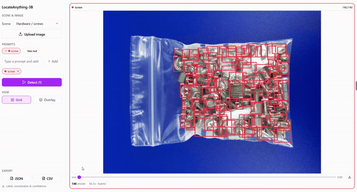

# LocateAnything-3B — Interactive Counting Demo

A portfolio project built around [NVIDIA LocateAnything-3B](https://huggingface.co/nvidia/LocateAnything-3B), an open-vocabulary object detection / visual-grounding VLM. The goal is an interactive demo that proves the model's core differentiator over YOLO-style detectors: swap the text prompt, swap the detection target — no retraining, no per-class model.



See `docs/locateanything-demo-scenarios.md` for the full scenario/positioning notes and `docs/spec-locateanything-demo.md` for the current spec (problem statement, user stories, implementation/testing decisions).

## Status

Core demo complete: tile pipeline, 5-scene registry, license disclosure UI, side-by-side multi-prompt comparison, and Docker Compose packaging are all done (tickets #01-07). Tracked on Trello (board: LocateAnything-3B — see `docs/agents/issue-tracker.md`).

## Quickstart (Docker Compose)

```sh
git submodule update --init --recursive   # if you cloned this repo fresh
docker compose up --build
```

- Frontend: http://localhost:5173

`docker-compose.yml` now runs the **frontend only** — it talks to a backend + GPU model already deployed on Modal (`modal_app/backend_server.py` + `modal_app/model_server.py`; see `DEPLOYMENT.md`), no local model weights or GPU needed. A real detection takes a few seconds per tile once warm (cold Modal containers add ~20-50s on the first request after idling — see `DEPLOYMENT.md`'s concurrency/cost notes).

**Fully local, CPU-only, no Modal account needed:** run the backend natively instead (see "Development environment (without Docker)" below) with `LA_INFERENCE_BACKEND=local` (its default), then point this same frontend at it: `VITE_API_BASE_URL=http://localhost:8000 docker compose up --build`. This is slower — a real detection takes **~65-80s per 512×512 tile** (see `docs/adr/0003`), so most scene images (6-30 tiles) take anywhere from a few minutes to 30-55+ minutes for one `/detect` call; this is a known, inherent characteristic of running a 3B-parameter VLM on CPU, not a bug. `docker-compose.triton.yml` is a similar one-command option for a self-hosted GPU (Triton) instead.

## Architecture

- **Inference engine:** [`mudler/locate-anything.cpp`](https://github.com/mudler/locate-anything.cpp) (vendored as a git submodule at `locate-anything.cpp/`) — a ggml/C++ port of LocateAnything-3B that runs real, non-mocked inference **on CPU**, validated box-identical to the official PyTorch model at `q8_0` quantization. No GPU is required or used anywhere in this project.
- **Backend:** a thin FastAPI service wrapping the engine behind a single `POST /detect` endpoint. Dense images are split into overlapping tiles, run through a persistent in-process engine (`backend/la_capi.py`, via `liblocate_anything`'s C API), and merged back by IoU (`backend/tiling.py`).
- **Frontend:** React + Vite + TypeScript (`frontend/`) — pick a scene or upload an image, type or click a prompt, see boxes + count, compare up to 3 prompts side by side.
- **Packaging:** Docker Compose for the frontend (`frontend/Dockerfile`, `docker-compose.yml` — see Quickstart above). `backend/Dockerfile` still builds a standalone local-CPU backend image for the fully-local option above (not wired into any compose file currently — run it directly with `docker build`/`docker run`, or run the backend natively instead); `backend/Dockerfile.triton` is the separate image `docker-compose.triton.yml` uses for the self-hosted-GPU option.

We deliberately dropped an earlier plan to reuse a third-party prebuilt Docker app (`gammahazard/locate-anything`) — it's CUDA-only with no CPU path and offered no way to customize sample scenes or license text. Both backend and frontend here are ours.

## Inference backend: local CPU or remote Triton (GPU)

By default the backend runs inference locally via the CPU engine above (`LA_INFERENCE_BACKEND=local`, the default). It can instead call a remote **Triton Inference Server** serving the original NVIDIA `LocateAnything-3B` PyTorch checkpoint on a GPU box:

```sh
export LA_INFERENCE_BACKEND=triton
export LA_TRITON_URL=<gpu-server-address>:8000
```

(or the equivalent env vars in `docker-compose.yml` / a `.env` file). See `triton/README.md` for building and running the Triton server itself (written for an NVIDIA DGX Spark, but not DGX-Spark-specific beyond the ARM64/Blackwell build notes), and `docs/adr/0005-pluggable-inference-backend-local-or-triton.md` for the design rationale.

A third option runs the same GPU model on [Modal](https://modal.com) instead of self-hosted hardware:

```sh
export LA_INFERENCE_BACKEND=modal
export LA_MODAL_URL=<modal endpoint URL>
export LA_MODAL_TOKEN=<shared bearer token>
```

See `DEPLOYMENT.md`'s "Deploying modal_app/model_server.py" section for how to deploy it and provision the required secrets. All three backends are interchangeable from the frontend's point of view — same `/detect` contract either way.

## Development environment

A dedicated conda environment (`locateanything`, Python 3.11, via **conda-forge** — not Anaconda's default channels, which require ToS acceptance) holds everything needed to build the engine and run its Python-side scripts (model download/conversion). No CUDA build of PyTorch is installed; this project is CPU-only end to end.

```sh
conda create -n locateanything -c conda-forge python=3.11 --override-channels
conda activate locateanything
conda install -c conda-forge cmake make cxx-compiler --override-channels
pip install --index-url https://download.pytorch.org/whl/cpu "torch>=2.2"
pip install -r requirements.txt
```

## Development environment (without Docker)

The Docker Compose path above is the one-command way to run the demo. The steps below are for running the backend/frontend natively — useful for development, or if you'd rather not build inside Docker.

### Build the inference engine

```sh
conda activate locateanything
git submodule update --init --recursive   # if you cloned this repo fresh
cd locate-anything.cpp
cmake -B build -DLA_BUILD_TESTS=ON -DLA_BUILD_CLI=ON -DLA_SHARED=ON
cmake --build build -j$(nproc)
```

`-DLA_SHARED=ON` also builds `liblocate_anything.so`, which the backend loads via `ctypes` (`backend/la_capi.py`) so the model is loaded once per process instead of once per CLI invocation — see `docs/adr/0003-persistent-capi-engine-for-tiling.md`. The CLI binary is still built and useful for manual/offline debugging, but the running backend does not shell out to it.

### Get the model

Required either way (native or Docker) — Docker Compose volume-mounts this directory rather than baking the ~6.3GB GGUF into the image (see ticket #07). Prebuilt weights, no local conversion needed:

```sh
conda activate locateanything
python -c "
from huggingface_hub import hf_hub_download
hf_hub_download(repo_id='mudler/locate-anything.cpp-gguf', filename='locate-anything-q8_0.gguf', local_dir='locate-anything.cpp/models')
"
```

`q8_0` (~6.3 GB) is recommended — near-lossless, detections identical to the official f32 model.

### Run the backend + frontend natively

```sh
# terminal 1
conda activate locateanything
cd backend
uvicorn app:app --reload --port 8000

# terminal 2
cd frontend
npm install   # first time only
npm run dev
```

Frontend: whatever URL Vite prints (typically http://localhost:5173). It talks to `http://localhost:8000` by default (override with `VITE_API_BASE_URL`).

### Run a single detection from the CLI (no backend)

```sh
locate-anything.cpp/build/examples/cli/locate-anything-cli detect \
  --model locate-anything.cpp/models/locate-anything-q8_0.gguf \
  --input <your-image.jpg> \
  --prompt "person" \
  --annotated out.png
```

## License

- **This project's own code:** to be decided/added.
- **`locate-anything.cpp`** (the inference engine port): MIT.
- **Model weights** — NVIDIA `LocateAnything-3B` and its base `Qwen2.5-3B`: both **non-commercial research licenses**. This project is scoped as portfolio/research use only; see `docs/locateanything-demo-scenarios.md` for the licensing notes that shaped this scope, and cite `locate-anything.cpp` (Di Giacinto & Palethorpe, LocalAI project) alongside the NVIDIA model per its README's citation request.

## Project management

- Tickets: Trello (see `docs/agents/issue-tracker.md` for board/list details)
- Agent-facing conventions (issue tracker, domain docs): `AGENTS.md`
